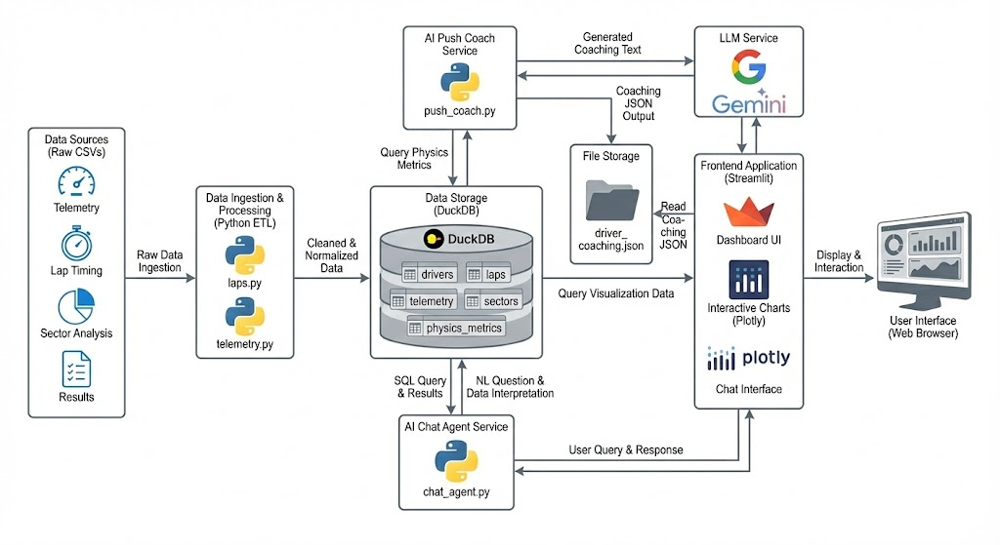

# ApexAI Co-Pilot – Sebring Race Analysis 🏁

ApexAI Co-Pilot is an AI-assisted race engineering dashboard built for the **Toyota – Hack the Track** hackathon.  
It turns raw lap & telemetry data from Sebring International Raceway into **actionable coaching** for a single driver:

- Where am I losing the most time?
- How consistent are my laps?
- Which corners should I attack first?
- What does the AI “race engineer” actually recommend I change?



## 🔍 Key Features

- **Driver Overview Dashboard**
  - Best lap, ideal lap, and time left on the table
  - Sector-level time loss and lap-time consistency
  - Clean, dark-mode UI optimized for track-side use

- **Track Map & Sector Context**
  - Embedded Sebring sector map
  - Sector summary table (S1 / S2 / S3) with average delta vs ideal
  - Sector Attack Plan cards (S1→S2→S3) explaining where and how to gain time

- **Ask ApexAI (Natural-Language Querying)**
  - Ask questions like **_“Is Car 7 consistent in Sector 1?”_** or  
    **_“Compare the best lap of Car 16 and Car 11.”_**
  - The app:
    1. Generates an SQL query,
    2. Shows the SQL,
    3. Executes it against the DuckDB file,
    4. Explains the result in plain English.

- **ApexAI Coach – Session Summary**
  - Short, AI-generated coaching summary for the selected driver
  - Highlights:
    - Time on table vs ideal lap
    - Which sector hurts pace the most
    - How consistent the driver is across laps
    - Clear next-step suggestions (where to focus first)

---

## 🧱 Tech Stack

- **Frontend:** [Streamlit](https://streamlit.io/) (Python)
- **Database:** [DuckDB](https://duckdb.org/) (`apex_copilot.duckdb`)
- **Data Manipulation:** `pandas`, `numpy`
- **Visualization:** `plotly`
- **AI / LLM:** (Optional) via `chat_agent.py` and `push_coach.py`

---

## Project Structure

```text
ApexAI_CoPilot/
├── config/
│   ├── settings.*          # Local config (paths, DB name, etc.)
│   └── openai_key          # NOT in git – contains your OpenAI API key
├── data_raw/
│   ├── logo.png            # App logo
│   ├── sebring_track_map.png
│   └── sebring/            # (optional) raw timing & telemetry Excel files
├── data_processed/
│   ├── analysis_wide.parquet
│   ├── drivers.parquet
│   ├── laps.parquet
│   ├── sectors.parquet
│   ├── telemetry.parquet
│   ├── telemetry_features.parquet
│   ├── driver_insights.json
│   └── driver_coaching.json
├── notebooks/              # (optional) exploration / EDA
├── src/
│   ├── ai/
│   │   ├── chat_agent.py   # NL → SQL + explanation
│   │   └── push_coach.py   # Sector coaching text generation
│   ├── analytics/
│   │   ├── deltas.py       # Sector & lap deltas
│   │   ├── ideal_lap.py    # Ideal lap computation
│   │   ├── insights.py     # Session-level insights
│   │   └── physics_metrics.py
│   ├── pipelines/
│   │   ├── laps.py
│   │   ├── sectors.py
│   │   ├── telemetry.py
│   │   ├── telemetry_features.py
│   │   └── physics_sector_metrics.py
│   └── ui/
│       └── app_streamlit.py  # Main Streamlit app
├── apex_copilot.duckdb     # DuckDB database with all processed tables
├── requirements.txt
├── setup_project.py        # (optional) build / ETL helpers
└── README.md
```

## 🚀 Getting Started

### 1. Create & Activate a Virtual Environment

**Windows**
```bash
python -m venv .venv
.venv\Scripts\activate
```

**macOS / Linux**
```bash
python3 -m venv .venv
source .venv/bin/activate
```

### 2. Install Dependencies
```bash
pip install -r requirements.txt
```

### 3. (Optional) Configure API Keys

If `chat_agent.py` or `push_coach.py` uses OpenAI or another LLM provider, set your API key as an environment variable.

**Windows (CMD)**
```cmd
set OPENAI_API_KEY=your_key_here
```

**macOS / Linux**
```bash
export OPENAI_API_KEY=your_key_here
```

*If your version of the app does not use external LLM APIs, you can skip this step.*

### 4. Run the Streamlit App
From the repository root:
```bash
streamlit run src/ui/app_streamlit.py
```

Then open the URL shown in your terminal (usually 👉 http://localhost:8501).

---

## 🕹️ How to Use the App

### ⭐ 1. Select a Driver

Use the dropdown in the left sidebar. The sidebar also displays:

- Driver ID  
- Car number  
- Class  

Your custom logo will also appear at the top.

### 📊 2. Overview Tab

This tab shows a complete snapshot of the driver's performance:

- **KPI Section**
- **Best Lap**
- **Ideal Lap**
- **Time on Table** (difference between best and ideal)

**Visualizations:**

- 📉 **Time Loss by Sector**  
  Shows how much time the driver is losing in S1, S2, S3.

- 📈 **Lap Time Consistency**  
  A line chart of actual vs ideal lap times to understand stability.

- 🤖 **ApexAI Coach – Session Summary**  
  Provides a 3-line coaching summary including:
  - Where most time is lost  
  - Which sector matters the most  
  - Driving style observations  
  - Clear improvement guidance

### 🗺️ 3. Track Map Tab

This tab helps you connect data → corners → coaching.

- 🏁 **Sebring Track Map**  
  Displays the full track with S1 / S2 / S3 highlighted.

- 📘 **Sector Summary**  
  A compact table showing:

  | Sector | Avg Δ vs Ideal (s) |
  |--------|---------------------|

  Helps identify which sector contributes the most to overall loss.

- 🔧 **Sector Attack Plan**  
  Three coaching cards (S1 → S2 → S3), each explaining:
  - Where the time loss occurs  
  - What inputs (brake, throttle, steering) cause the loss  
  - How to improve: braking point, entry speed, apex rotation, exit throttle, etc.

  This is designed for real race-engineering style coaching.

### 💬 4. Ask ApexAI Tab

The most powerful feature — natural language analytics.

**How to use:**
1. Select a driver in the sidebar.
2. Ask a question like:
   - "Is Car 7 consistent in Sector 1?"
   - "Compare the best lap of Car 16 and Car 7."
   - "Where is Driver D_13 losing the most time?"
   - "Why am I losing time in Sector 3? Check my braking."
   - "What is the ideal lap time for Car 11?"

**You will get:**

- 🟦 **Generated SQL**  
  The query the model created from your question.

- 🟩 **Query Result**  
  Numbers pulled from the DuckDB database.

- 🟧 **ApexAI Explanation**  
  A 1–3 sentence natural-language summary that combines:
  - SQL results  
  - Driver context  
  - Sector logic  

This makes analysis accessible to drivers, engineers, and team managers.

---

## ✅ Testing Checklist

Before sharing your repo, verify everything works:

### General
- ✔ `streamlit run src/ui/app_streamlit.py` runs without errors  
- ✔ Sidebar shows your logo, driver dropdown, and updates the driver card

### Overview Tab
- ✔ KPI values update per driver  
- ✔ Time Loss by Sector chart shows 3 bars (S1/S2/S3)  
- ✔ Lap Time Consistency chart loads correctly  
- ✔ ApexAI Session Summary text updates

### Track Map Tab
- ✔ Track map image loads  
- ✔ Sector Summary table looks correct  
- ✔ Sector Attack Plan cards appear in order: S1 → S2 → S3

### Ask ApexAI Tab
- ✔ SQL is generated for valid questions  
- ✔ Query executes without errors  
- ✔ ApexAI explanation text matches the result

*When all tests pass, the app is ready for judges, teammates, or recruiters 🚀*

---

## 🔁 (Optional) Rebuild the Processed Data

If you want to regenerate all Parquet files and rebuild `apex_copilot.duckdb`:
```bash
python setup_project.py
```

This will:
- Load raw Excel files from `data_raw/sebring/`
- Generate parquet files into `data_processed/`
- Rebuild the DuckDB database


